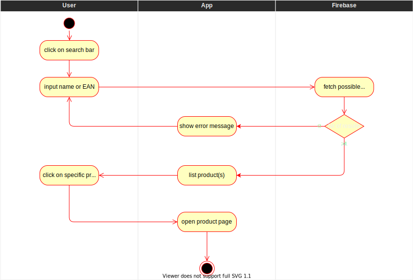
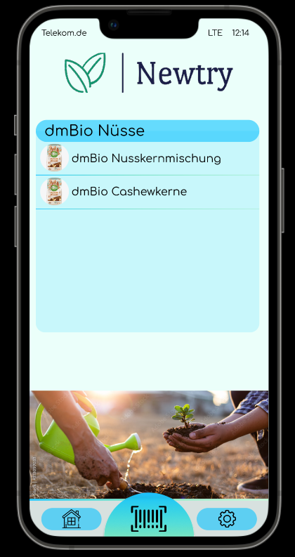

# Search products by search bar
Accessing the more detailed product information requires being able to find a specific product and access it's details. For this purpose a search bar which is able to find the product by its barcode number or product name has to be implemented.

# 1 Flow of Events
## 1.1 Basic Flow
- user clicks on "search bar"
- user inputs a product name or EAN into the "search bar"
- list of products is updated on-the-fly
    - every result contains name and picture of the product
- user clicks on a specific product which opens the detailed product page

### 1.1.1 Activity Diagram

### 1.1.2 Mock-up


### 1.1.3 Narrative
```gherkin
Feature: Searchbar
  
    As any user I want to be able to search products by clicking on the searchbar.

    Background:
        Given I am on the homepage.

    Scenario: Search a product with the searchbar
        Given I am on the homepage and clicked on the searchbar
        Then a keyboard opens.
        When I type in a products name or EAN
        Given that the product doesn't exist
        Then a error message is shown on the screen
        Given that the product exists 
        Then a list of possible products is shown below the searchbar
        When I click on one of the products listed below the searchbar
        Then product page opens
```
## 1.2 Alternative Flows
If there are no products that fit the search term:
- user clicks on "search bar"
- user inputs a product name or EAN into the "search bar"
- list of products is updated on-the-fly
- error message "no product found" is shown

If there are multiple products with a matching name or EAN:
- user clicks on "search bar"
- user inputs a product name or EAN into the "search bar"
- list of products is updated on-the-fly 
- a list of all found products is shown


# 2 Special Requirements
(n/a)

# 3 Preconditions
- the product is present in the database
- user has the product name or EAN

# 4 Postconditions
(n/a)
 
# 5 Extension Points
(n/a)
