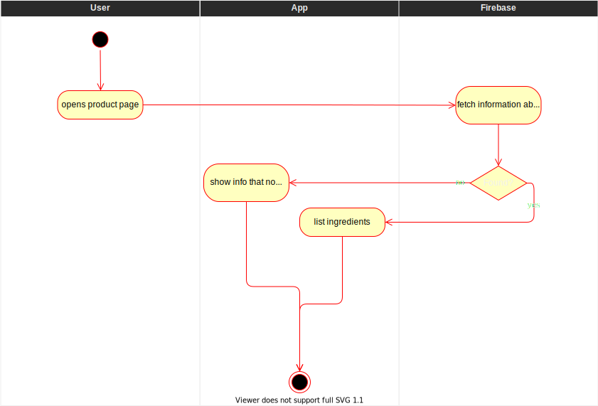
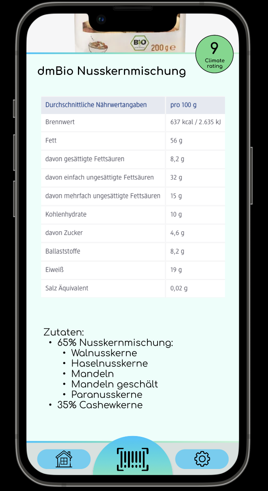

# Show ingredients
Ingredients give you an overview of what is actually inside of what you are buying. Therefore it is one of the fundamental features. The list of ingredients is expected to be as complete as possible and therefore *may* include ingredients that don't have to be listed on the product itself because of legal regulations.

- Ingredient list 
  - Ingredients with percentage
- Substances or products causing allergies or intolerances
- Additives

# 1 Flow of Events
## 1.1 Basic Flow
- user opens product page of a specific product ([search bar](./UC1_Searchbar.md)/[barcode](./UC4_Scanner.md))
- information is fetched from the database
- information is shown in dedicated section of product page

### 1.1.1 Activity Diagram


### 1.1.2 Mock-up


### 1.1.3 Narrative
```gherkin
Feature: Ingredients

    As any user I want to be able to see the ingredients of the scanned/searched product

    Scenario: Show products ingredients (success)
        Given that I am on "dmBio Nusskernmischung"  product page
        When "dmBio Nusskernmischung" has a database entry
        Then "35% Cashewkerne ..." is shown in the nutrition window

    Scenario: Show products  ingredients (fail)
        Given that I am on "dmBio Nusskernmischung"  product page
        When "dmBio Nusskernmischung" doesn't have a database entry
        Then a error message will be shown on the screen
```

## 1.2 Alternative Flows
If no information for a specific product is present:
- user opens product page of a specific product ([search bar](./UC1_Searchbar.md)/[barcode](./UC4_Scanner.md))
- information is fetched from the database
- error message "no information for ingredients found" is shown

# 2 Special Requirements
(n/a)

# 3 Preconditions
- user knows which specific product he wants to know the ingredients of
- the product is present in the database

# 4 Postconditions
(n/a)
 
# 5 Extension Points
(n/a)
