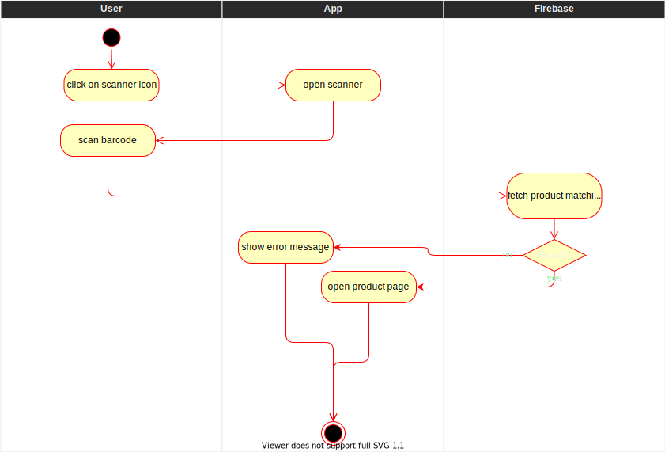

# Scan barcode
To ease the use of the app and make it more appealing to the user it should be possible to just scan the barcode of a product instead of having to use the search bar manually.

# 1. Flow of Events
## 1.1 Basic Flow
- user clicks on symbol to open scanner
- user scans barcode
- information is fetched from the database
- product page belonging to the scanned barcode is opened

### 1.1.1 Activity Diagram


### 1.1.2 Mock-up


### 1.1.3 Narrative
```gherkin
Feature: Scan Barcode

    As any user I want to be able to scan products by clicking on the scan button.

    Background:
        Given I am on the homepage.

    Scenario: Scan a product with the scan button
        Given I am on the homepage and click on the scan button
        Then the scanner page opens
        Given I scan a products barcode
        Then the app will try to fetch the corresponding product
        Given the product was not found
        Then a error message will be shown on the screen
        Given the product was found
        Then the product page opens
```

## 1.2 Alternative Flows
(n/a)

# 2. Special Requirements
- all typical EAN/EAN-13 barcodes are expected to be supported
- device features a decent camera

# 3. Preconditions
- barcode is readable: shape of barcode (crinkles), lighting conditions
- user has granted the app permission to use the camera 

# 4. Postconditions
(n/a)
 
# 5. Extension Points
(n/a)
