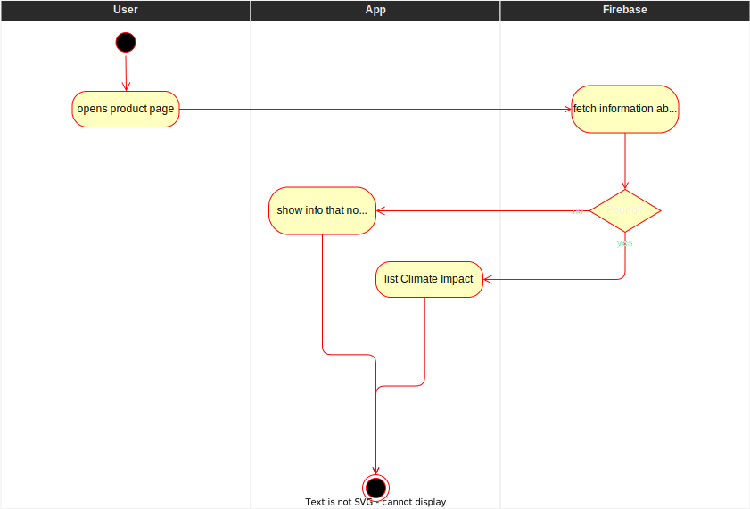
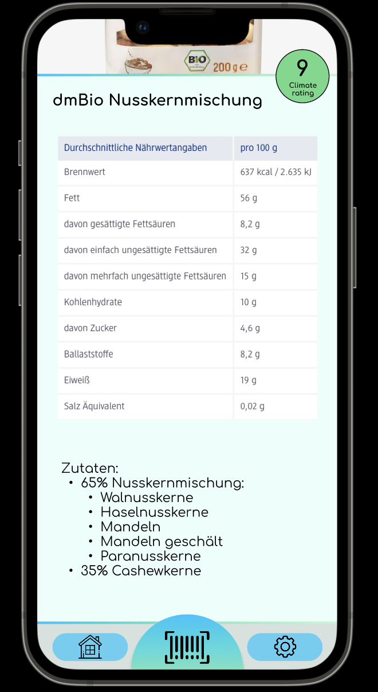

# Show climate impact score
The climate impact score gives a rough estimation about the product's 
impact on the environment. It is calculated, based on the information 
fetched from Open Food Facts. The score ranges from 0 to 10 (0 is the worst 
and 10 the best). Additionally, the score is highlighted in colors from red 
to green based on the rating.

# 1 Flow of Events
## 1.1 Basic Flow
- user opens product page of a specific product ([search bar](./UC1_Searchbar.md)/[barcode](./UC4_Scanner.md))
- information is fetched from the database
- climate impact score is calculated
- climate impact score is shown in dedicated section of product page

### 1.1.1 Activity Diagram

### 1.1.2 Mock-up

### 1.1.3 Narrative
(n/a)

## 1.2 Alternative Flows
If no information for a specific product is present:
- user opens product page of a specific product ([search bar](./UC1_Searchbar.md)/[barcode](./UC4_Scanner.md))
- information is fetched from the database
- error message "no information for climate impact found" is shown

# 2 Special Requirements
(n/a)

# 3 Preconditions
- user knows which specific product he wants to know the climate impact score of
- information to calculate a climate impact score is present in the database

# 4 Postconditions
(n/a)

# 5 Extension Points
(n/a)
