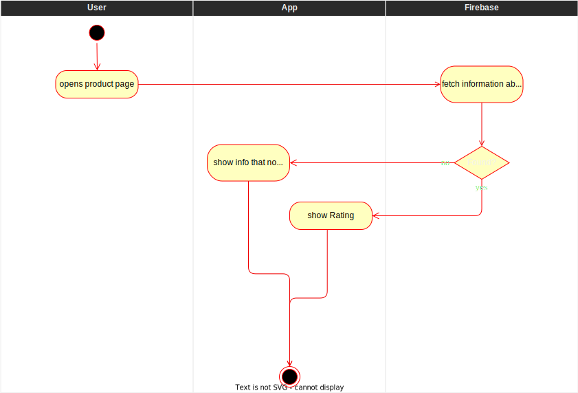

# Show user rating
The user rating gives information about other users opinions on the product. 
It is calculated, based on the average of all the user ratings submitted. 
Additionally, the total amount of ratings is shown below the average rating.
The score ranges from 1 to 5 and is displayed in a star-like manner. 
# 1 Flow of Events
## 1.1 Basic Flow
- user opens product page of a specific product ([search bar](./UC1_Searchbar.md)/[barcode](./UC4_Scanner.md))
- ratings are fetched from the database
- average rating is calculated
- rating is shown in dedicated section of product page

### 1.1.1 Activity Diagram

### 1.1.2 Mock-up

### 1.1.3 Narrative
(n/a)

## 1.2 Alternative Flows
If no ratings for a specific product is present:
- user opens product page of a specific product ([search bar](./UC1_Searchbar.md)/[barcode](./UC4_Scanner.md))
- ratings are fetched from the database
- the product is displayed as 0 stars and the amount of ratings is 0

# 2 Special Requirements
(n/a)

# 3 Preconditions
- user knows which specific product he wants to know the rating of
- information to calculate an average rating is present in the database

# 4 Postconditions
(n/a)

# 5 Extension Points
(n/a)
