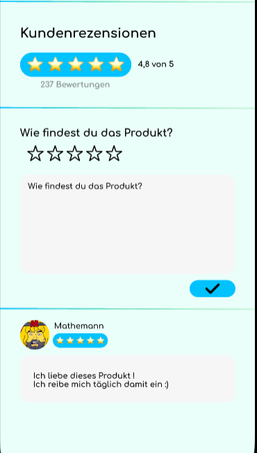

# Show user rating
Users can give their opinion on a specific product. The rating ranges from 1 
to 5 stars. Furthermore, the user can provide a comment to explain his 
rating to other users. 
# 1 Flow of Events
## 1.1 Basic Flow
- user opens product page of a specific product ([search bar](./UC1_Searchbar.md)/[barcode](./UC4_Scanner.md))
- user clicks on the desired amount of stars
- (user enters a comment)
- user clicks on the checkmark to submit his comment
- comment is saved to the database

### 1.1.1 Activity Diagram

### 1.1.2 Mock-up

### 1.1.3 Narrative
(n/a)

## 1.2 Alternative Flows
The comment contains inadmissible content:
- user opens product page of a specific product ([search bar](./UC1_Searchbar.md)/[barcode](./UC4_Scanner.md))
- user clicks on the desired amount of stars
- user enters a inadmissible comment
- the user gets an error message which tells him to alter his comments content

# 2 Special Requirements
(n/a)

# 3 Preconditions
- user knows which specific product he wants to rate
- the user is logged in 

# 4 Postconditions
(n/a)

# 5 Extension Points
(n/a)
