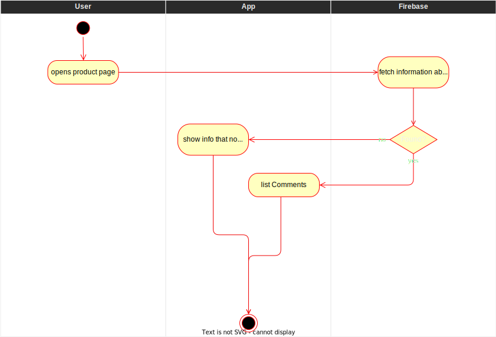
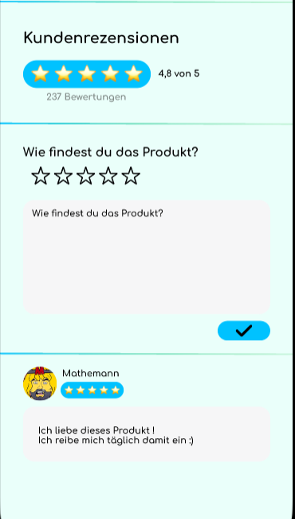

# Show user rating
The user comments give additional information about the user rating. They 
are displayed below a user rating.
# 1 Flow of Events
## 1.1 Basic Flow
- user opens product page of a specific product ([search bar](./UC1_Searchbar.md)/[barcode](./UC4_Scanner.md))
- ratings are fetched from the database
- a list of ratings with their corresponding comments is displayed

### 1.1.1 Activity Diagram

### 1.1.2 Mock-up

### 1.1.3 Narrative
(n/a)

## 1.2 Alternative Flows
If no ratings for a specific product is present:
- user opens product page of a specific product ([search bar](./UC1_Searchbar.md)/[barcode](./UC4_Scanner.md))
- ratings are fetched from the database
- the product is displayed as 0 stars and the amount of ratings is 0
- a field with no "No reviews yet" is displayed

# 2 Special Requirements
(n/a)

# 3 Preconditions
- user knows which specific product he wants to know the see the comments of
- ratings are present in the database

# 4 Postconditions
(n/a)

# 5 Extension Points
(n/a)
